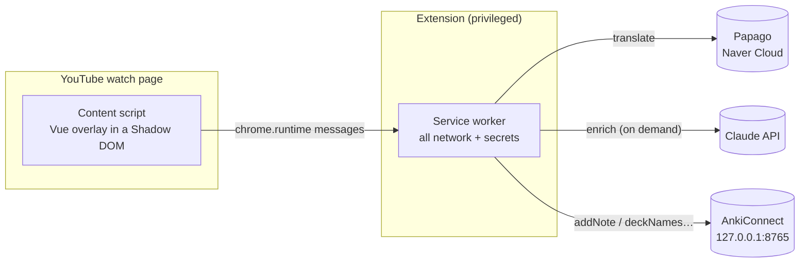

# Korean Anki Miner

> A Chrome extension that turns Korean YouTube subtitles into Anki flashcards — click a word, see the translation, save the card.


Existing immersion tools (Migaku, Language Reactor) lock the core mining loop — *see a word's meaning, click, save it to Anki* — behind subscriptions and a lot of feature bloat. **Korean Anki Miner does only that loop, and does it well.** It overlays the captions on any `youtube.com/watch` page, makes every word clickable, and turns a click into an Anki card in a couple of seconds.

## Demo

<!-- Replace with a screenshot or GIF of the click → translate → save flow. -->
> 📹 _Demo GIF coming soon — drop one in at `docs/demo.gif`._

## Features

- **Interactive captions** — the native subtitle is replaced by an overlay where every word is a clickable, hover-highlighted token. Punctuation is split off so a click yields the bare word.
- **Instant translation** — clicking a word shows a [Papago](https://www.ncloud.com/product/aiService/papagoTranslation) translation in an anchored popup. Results are cached, so repeats are instant and free.
- **One-click mining** — a *Save to Anki* button opens an editable card preview (Front / Back / Extra / Image), prefilled with the word, its translation, the subtitle sentence, and a screenshot of the current frame (with the subtitle burned in), then writes the note via [AnkiConnect](https://foosoft.net/projects/anki-connect/).
- **Optional AI enrichment** — an *Enrich with AI* button calls Claude to fill the dictionary form, a refined gloss, and a formatted explanation (key expressions, examples, related words). On-demand only, behind a pluggable provider, with a selectable model (Haiku for cost, Sonnet for quality).
- **Survives YouTube's SPA navigation**, isolates itself in a Shadow DOM, and keeps every secret and network call out of the page.

## How it works

The extension is split along a strict trust/privilege boundary: the content script owns the DOM but holds no secrets and makes no network calls; the service worker is the only place keys live and the only place that talks to the network.



A deliberate **two-provider split** sits behind small adapter interfaces (`TranslationProvider`, `EnrichmentProvider`):

| Path | Provider | When | Why |
| --- | --- | --- | --- |
| **Translation** (click) | Papago | Nearly every word | Optimized for latency/cost; best-in-class for Korean; free at single-word volume |
| **Enrichment** (save) | Claude | Only when *Enrich* is clicked | Rich, structured output; kept rare and on-demand so it stays cheap |

## Tech stack

- **[WXT](https://wxt.dev)** — Manifest V3 extension framework (HMR, manifest generation, first-class Vue).
- **Vue 3** (Composition API) + **TypeScript** — overlay, popup, and options page.
- **Anthropic SDK** for enrichment; raw `fetch` adapters for Papago and AnkiConnect.

## Getting started

### Prerequisites

- **Node.js 20+** and npm
- **Google Chrome** (or any Chromium browser)
- **[Anki](https://apps.ankiweb.net/)** with the **[AnkiConnect](https://ankiweb.net/shared/info/2055492159)** add-on
- A **Naver Cloud Platform** account with a [Papago Translation](https://www.ncloud.com/product/aiService/papagoTranslation) application (Client ID + Secret)
- *(optional)* an **[Anthropic API key](https://console.anthropic.com/)** for AI enrichment

### Install & build

```bash
npm install
npm run build        # outputs the unpacked extension to .output/chrome-mv3
```

For development with hot-reload, use `npm run dev` instead (it builds to the same folder and launches a Chrome instance with the extension loaded).

### Load it in Chrome

1. Open `chrome://extensions` and enable **Developer mode** (top-right).
2. Click **Load unpacked** and select `.output/chrome-mv3`.
3. Note the extension's **ID** shown on the card — you'll need it for AnkiConnect.

### Configure

Open the extension's **Options** page (right-click the icon → *Options*) and fill in:

1. **Translation — Papago:** your Client ID and Secret, and the language pair (default `Korean → English`).
2. **Anki:** let Anki talk to the extension by adding its origin to AnkiConnect's CORS allowlist —
   Anki → *Tools → Add-ons → AnkiConnect → Config*:
   ```json
   { "webCorsOriginList": ["http://localhost", "chrome-extension://<your-extension-id>"] }
   ```
   Restart Anki, then pick your **deck**, **note type**, and map the **Front / Back / Extra** fields.
3. **Enrichment — Claude** *(optional):* your Anthropic API key and the model to use.

### Use it

Open any Korean video with captions on, turn on **CC**, then **click a word** → read the translation → **Save to Anki** → (optionally) **Enrich with AI** → **Save**.

## Project structure

```
entrypoints/
  background.ts          # service worker — message router; all network lives here
  youtube.content.ts     # content script — mounts the Shadow-DOM overlay on watch pages
  options/               # Vue options page (Papago / Anki / Claude config)
overlay/                 # in-page Vue UI: caption overlay, word popup, editable card preview
translation/             # TranslationProvider + Papago adapter + surface-form cache
enrichment/              # EnrichmentProvider + Claude adapter
anki/                    # AnkiConnect adapter (deckNames / modelFieldNames / addNote)
config/                  # typed chrome.storage items (sync prefs, local keys)
wxt.config.ts            # manifest, permissions, host_permissions
```

## Development

| Command | Description |
| --- | --- |
| `npm run dev` | Build + launch Chrome with HMR |
| `npm run build` | Production build to `.output/chrome-mv3` |
| `npm run compile` | Type-check with `vue-tsc` |
| `npm run zip` | Package a distributable zip |

## Design notes

A few decisions worth calling out:

- **Secrets and network stay in the service worker.** The content script runs in the page; it only sends `chrome.runtime` messages. API keys live in `chrome.storage.local` and never touch the DOM, so a compromised page can't read them.
- **The overlay is mounted in a Shadow DOM.** YouTube's CSS and ours can't leak into each other; styles are injected as a web-accessible resource, not into the page.
- **Captions are read from the rendered DOM** (`.ytp-caption-segment`), not the `timedtext` endpoint — the latter now requires an un-synthesizable proof-of-origin token.
- **Provider adapters** mean swapping Papago/Claude (or routing through a proxy if this were ever distributed) is a config change, not a rewrite.
- **Enrichment is on-demand and model-selectable** — the expensive call only fires when you ask for it, and you choose the cost/quality tradeoff.

## Roadmap

- [x] **Image field** — capture the current video frame (subtitle burned in) → `storeMediaFile` → a mapped picture field.
- [ ] Nicer duplicate handling (`canAddNotes` pre-check + "add anyway").
- [ ] A second enrichment provider behind `EnrichmentProvider`.

## License

MIT — see [`LICENSE`](LICENSE).
