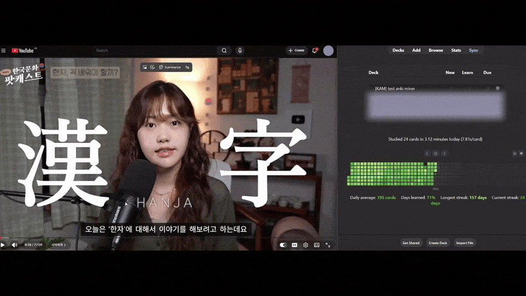
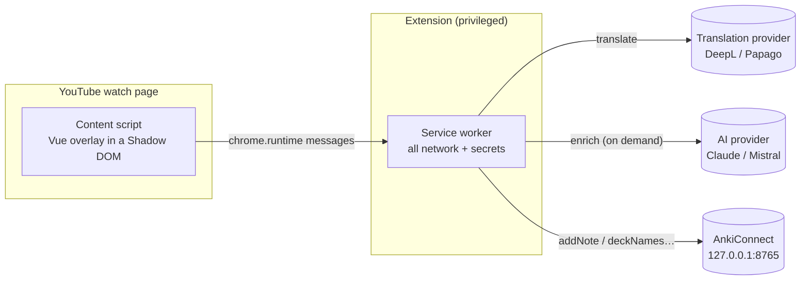

# Korean Anki Miner

> A Chrome extension that turns Korean YouTube subtitles into Anki flashcards — click a word, see the translation, save the card.


Existing immersion tools (Migaku, Language Reactor) lock the core mining loop — _see a word's meaning, click, save it to Anki_ — behind subscriptions and a lot of feature bloat. **Korean Anki Miner does only that loop, and does it well.** It overlays the captions on any `youtube.com/watch` page, makes every word clickable, and turns a click into an Anki card in a couple of seconds.

## Demo



_Click a word in the caption overlay → the card preview → **Enrich with AI** → the note in Anki, complete with the video frame and an explanation with key expressions, examples, and related words._

## Features

- **Interactive captions** — the native subtitle is replaced by an overlay where every word is a clickable, hover-highlighted token. Punctuation is split off so a click yields the bare word.
- **Instant translation** — clicking a word shows a translation in an anchored popup, from your chosen provider — **[DeepL](https://www.deepl.com/pro-api) or [Papago](https://www.ncloud.com/product/aiService/papagoTranslation)**. Results are cached per provider, so repeats are instant and free, and the popup credits whichever provider answered.
- **One-click mining** — a _Save to Anki_ button opens an editable card preview (Front / Back / Extra), prefilled with the word, its translation, and the subtitle sentence, then writes the note via [AnkiConnect](https://foosoft.net/projects/anki-connect/).
- **Screenshot capture** — the card's Image field grabs the current video frame with the subtitle burned in, stores it through AnkiConnect, and renders it on the card. Capture happens on demand, with recapture/remove controls.
- **Optional AI enrichment** — an _Enrich with AI_ button calls your chosen provider — **Claude or Mistral** — to fill the dictionary form, a refined gloss, and a formatted explanation (key expressions, examples, related words). On-demand only, with a selectable model per provider (cheap by default, larger for quality); both share one prompt, so cards come out identical either way.
- **Survives YouTube's SPA navigation**, isolates itself in a Shadow DOM, and keeps every secret and network call out of the page.

## How it works

The extension is split along a strict trust/privilege boundary: the content script owns the DOM but holds no secrets and makes no network calls; the service worker is the only place keys live and the only place that talks to the network.


```mermaid
flowchart LR
  subgraph page["YouTube watch page"]
    cs["Content script<br/>Vue overlay in a Shadow DOM"]
  end
  subgraph ext["Extension (privileged)"]
    sw["Service worker<br/>all network + secrets"]
  end
  cs -- "chrome.runtime messages" --> sw
  sw -- "translate" --> tr[("Translation provider<br/>DeepL / Papago")]
  sw -- "enrich (on demand)" --> ai[("AI provider<br/>Claude / Mistral")]
  sw -- "addNote / deckNames…" --> anki[("AnkiConnect<br/>127.0.0.1:8765")]
```

A deliberate **two-path split** sits behind small adapter interfaces (`TranslationProvider`, `EnrichmentProvider`):

| Path                    | Provider          | When                          | Why                                                                                                            |
| ----------------------- | ----------------- | ----------------------------- | -------------------------------------------------------------------------------------------------------------- |
| **Translation** (click) | DeepL or Papago   | Nearly every word             | Optimized for latency/cost; DeepL's free tier (1M characters, lifetime) covers hundreds of thousands of clicks |
| **Enrichment** (save)   | Claude or Mistral | Only when _Enrich_ is clicked | Rich, structured output; kept rare and on-demand so it stays cheap                                             |

## Tech stack

- **[WXT](https://wxt.dev)** — Manifest V3 extension framework (HMR, manifest generation, first-class Vue).
- **Vue 3** (Composition API) + **TypeScript** — overlay, popup, and options page.
- **Anthropic SDK** for Claude enrichment; raw `fetch` adapters for Mistral, DeepL, Papago, and AnkiConnect.

## Getting started

### Prerequisites

- **Google Chrome** (or any Chromium browser — Edge, Brave)
- **[Anki](https://apps.ankiweb.net/)** with the **[AnkiConnect](https://ankiweb.net/shared/info/2055492159)** add-on
- A translation API key — either a **[DeepL API](https://www.deepl.com/pro-api)** key (Free or Pro; the Free plan's lifetime limit of 1M characters goes a long way at a few characters per click) or a **Naver Cloud Platform** [Papago Translation](https://www.ncloud.com/product/aiService/papagoTranslation) application (Client ID + Secret)
- _(optional)_ an **[Anthropic](https://console.anthropic.com/)** or **[Mistral](https://console.mistral.ai/)** API key for AI enrichment
- _(only for building from source — Option B)_ **Node.js 20+** and npm

### Install

A built extension is OS-independent — the same files load on Windows, macOS, and Linux.

**Option A — from a release (just use it)**

1. Go to the [**Releases**](https://github.com/benvasseur/korean-anki-miner/releases) page and download `korean-anki-miner-<version>-chrome.zip`.
2. Unzip it into a **permanent** folder — Chrome reads the extension off disk on every launch, so don't leave it in Downloads or a temp dir.

**Option B — from source (development)**

```bash
npm install
npm run build        # outputs the unpacked extension to .output/chrome-mv3
```

For development with hot-reload, use `npm run dev` instead (it builds to the same folder and launches a Chrome instance with the extension loaded).

### Load it in Chrome

1. Open `chrome://extensions` and enable **Developer mode** (top-right).
2. Click **Load unpacked** and select the unzipped folder (Option A) or `.output/chrome-mv3` (Option B).

### Configure

Open the extension's **Options** page (right-click the icon → _Options_) and fill in:

1. **Translation:** pick a provider — **DeepL** (paste the API key; Free keys end in `:fx` and are routed to the free endpoint automatically) or **Papago** (Client ID + Secret) — and the language pair (default `Korean → English`).
2. **Anki:** start Anki with the AnkiConnect add-on installed, then pick your **deck**, **note
   type**, and map the **Front / Back / Extra** fields. No CORS setup is needed: calls are made
   from the background with host permissions, so they carry no `Origin` header and AnkiConnect
   allows them (and its default `http://localhost` entry allows extension origins anyway).
3. **Enrichment — AI** _(optional):_ pick a provider (Claude or Mistral), then its API key and the model to use.

### Use it

Open any Korean video with captions on, turn on **CC**, then **click a word** → read the translation → **Save to Anki** → (optionally) **Enrich with AI** → **Save**.

## Project structure

```
entrypoints/
  background.ts          # service worker — message router; all network lives here
  youtube.content.ts     # content script — mounts the Shadow-DOM overlay on watch pages
  options/               # Vue options page (translation / Anki / enrichment config)
overlay/                 # in-page Vue UI: caption overlay, word popup, editable card preview
                         #   + pure modules: tokenize, sanitize, frame capture
translation/             # TranslationProvider + DeepL/Papago adapters + surface-form cache
enrichment/              # EnrichmentProvider + Claude/Mistral adapters + shared prompt
anki/                    # AnkiConnect adapter (deckNames / modelFieldNames / addNote)
config/                  # typed chrome.storage items (sync prefs, local keys)
*.test.ts                # unit tests, next to the module they cover
wxt.config.ts            # manifest, permissions, host_permissions
```

## Development

| Command           | Description                              |
| ----------------- | ---------------------------------------- |
| `npm run dev`     | Build + launch Chrome with HMR           |
| `npm run build`   | Production build to `.output/chrome-mv3` |
| `npm run compile` | Type-check with `vue-tsc`                |
| `npm test`        | Run the unit tests (Vitest)              |
| `npm run lint`    | ESLint + Prettier check                  |
| `npm run zip`     | Package a distributable zip              |

### Testing

Vitest with `happy-dom`, plus WXT's `fakeBrowser` so modules that touch `chrome.storage`
run against a real in-memory implementation rather than a hand-written stub. What's covered:

- **Provider adapters** — request shape and, especially, the error mapping: DeepL's free
  vs Pro host selection from the `:fx` key suffix, its language-code mapping (`en` → `EN-US`
  as a target, plain `EN` as a source), and 401 / 429 / **456 quota** / network failures for
  each provider. A mocked `fetch` stands in for the API.
- **The sanitizer** — [`overlay/sanitize.test.ts`](overlay/sanitize.test.ts) is an attack
  list. The Extra field is model-generated HTML rendered with `v-html` _and_ written into an
  Anki note, so anything that survives sanitizing executes in two script-capable contexts;
  the tests assert that event handlers, `javascript:` URLs, `<script>`, and malformed markup
  all come out inert.
- **Caption tokenizing** — Hangul with combining marks, punctuation runs, mixed scripts.
- **Translation cache** — keyed by provider + language pair + surface form.

Every push and PR runs CI (lint + type-check + tests + build). To **cut a release**, bump
`version` in `package.json`, commit, then tag it:

```bash
git tag v0.1.0 && git push --tags
```

The release workflow builds the zip and publishes it to [Releases](https://github.com/benvasseur/korean-anki-miner/releases) automatically.

## Design notes

A few decisions worth calling out:

- **Secrets and network stay in the service worker.** The content script runs in the page; it only sends `chrome.runtime` messages. API keys live in `chrome.storage.local` and never touch the DOM, so a compromised page can't read them.
- **The overlay is mounted in a Shadow DOM.** YouTube's CSS and ours can't leak into each other; styles are injected as a web-accessible resource, not into the page.
- **Captions are read from the rendered DOM** (`.ytp-caption-segment`), not the `timedtext` endpoint — the latter now requires an un-synthesizable proof-of-origin token.
- **Provider adapters** mean adding a backend is a new file, not a rewrite — the Mistral provider dropped in behind the same interface as Claude, sharing one prompt module. Routing through a proxy (if this were ever distributed) would be the same kind of change.
- **Enrichment is on-demand, provider- and model-selectable** — the expensive call only fires when you ask for it, and you choose the cost/quality tradeoff.

## Roadmap

- [ ] **Google Translate as a translation provider** — a third `TranslationProvider` (Cloud Translation API v2) alongside DeepL and Papago; needs a Google Cloud API key and `host_permissions` for `translation.googleapis.com`.
- [ ] **ChatGPT as an enrichment provider** — a third `EnrichmentProvider` (OpenAI chat completions, forced tool call for structured output) reusing the shared `enrichment/prompt.ts`, so cards come out identical to the Claude/Mistral ones.
- [ ] **Firefox support** — add WXT's `firefox` target (MV2 background page; add the `moz-extension://…` origin to AnkiConnect's CORS allowlist).
- [ ] **Safari support** — WXT can target Safari (dedicated runner, MV2 manifest); packaging needs macOS + Xcode's web-extension converter.
- [ ] **Publish to the extension stores** — signed builds on the Chrome Web Store / Firefox Add-ons instead of load-unpacked, for auto-update and no developer-mode prompt.
- [ ] Nicer duplicate handling (`canAddNotes` pre-check + "add anyway").

## License

MIT — see [`LICENSE`](LICENSE).
